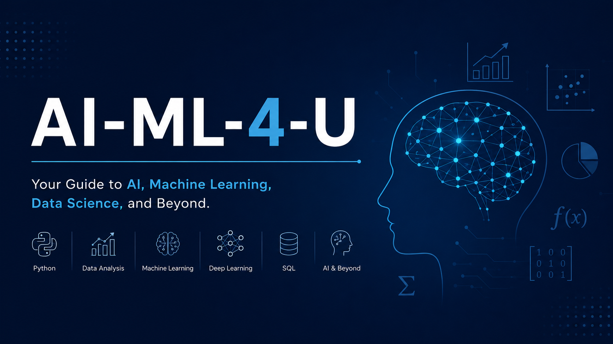
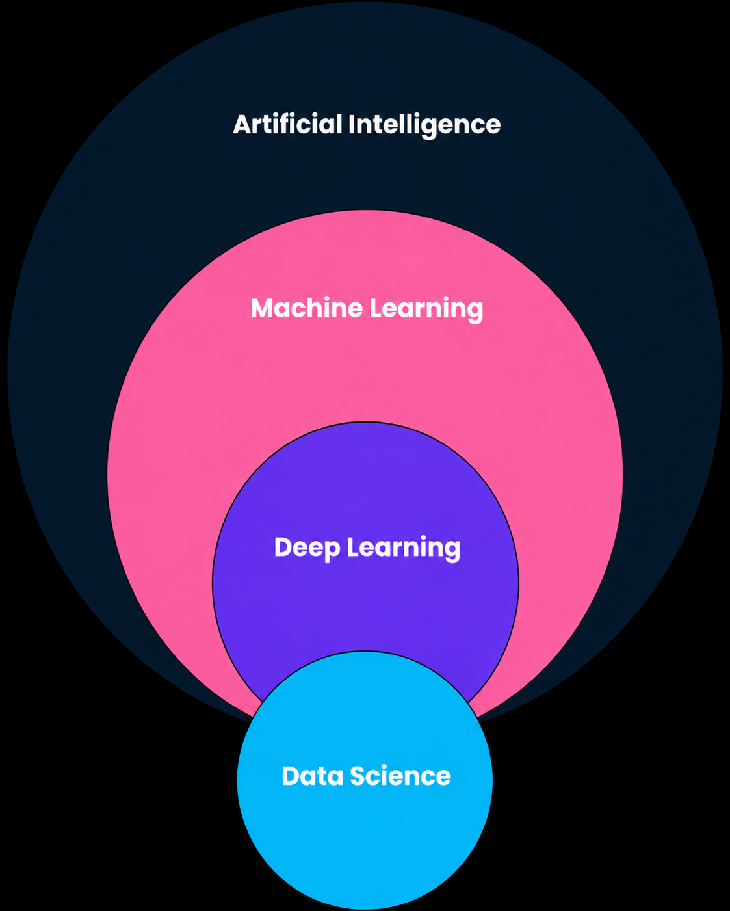
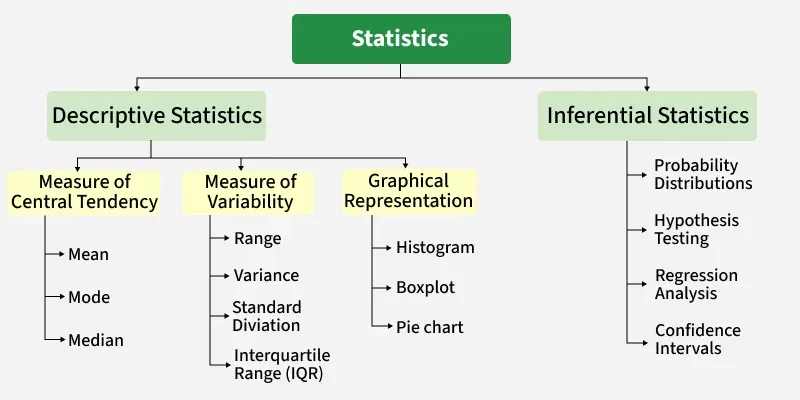
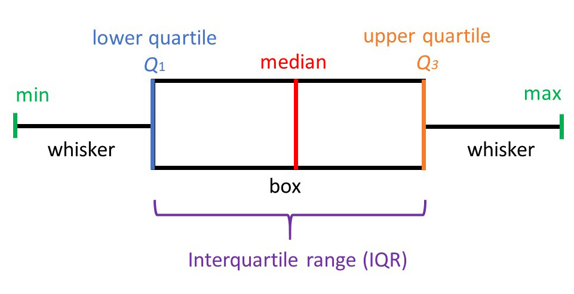
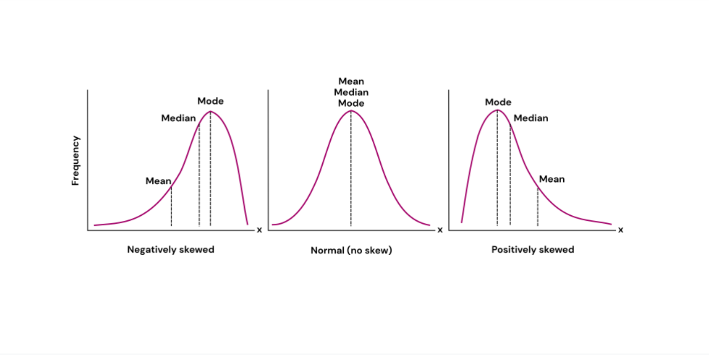
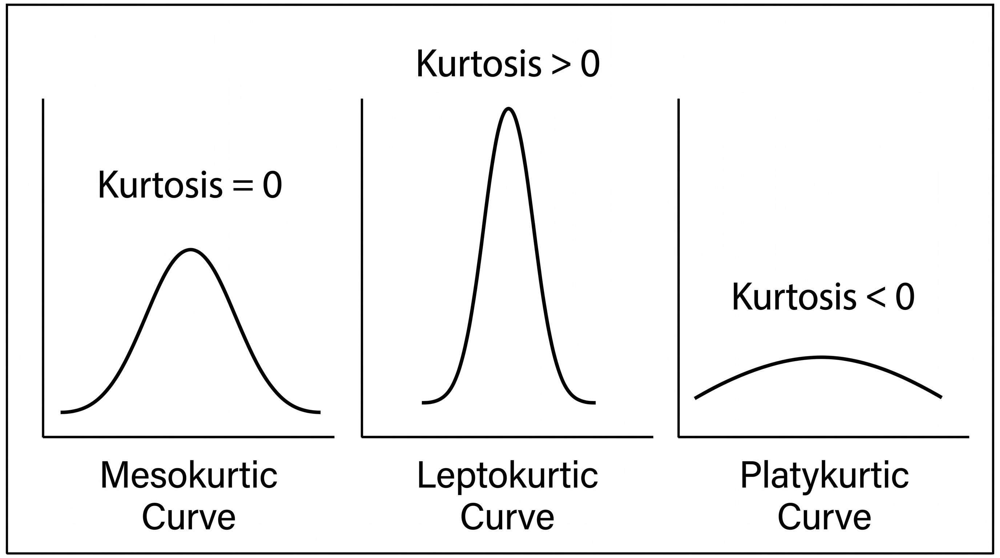

***
# **Pre-requisites:**

* **Linear Algebra:** for representing data using vectors, matrices and performing transformations.
* **Calculus:** for optimization and understanding how models learn and update parameters.
* **Statistics \& Probability:** for modeling uncertainty, analyzing data and making predictions.

&nbsp;&nbsp;&nbsp; **python (syntax \& logic)**

***
# **Intro:**

* **AI (Artificial Intelligence):** Making machines perform tasks that normally require human intelligence.
* **ML (Machine Learning):** Teaching machines to learn patterns from data and make predictions without explicitly programming every rule.
* **DL (Deep Learning):** An advanced type of ML that learns complex patterns by uses neural networks on Big-Data.

***

<H2>Statistics</h2>

 

<b>Types of Data:</b>

 

* **Numerical/Quantitative Data:** Data represented by numbers that can be measured or counted.
* **Categorical/Qualitative Data:** Data represented by labels or categories that describe characteristics.

# 

<b>Types of Dataset's:</b>

 

* **Population:** The complete set of individuals, items, or observations you want to study.
* **Sample:** A smaller group selected from the population, used for analysis.

>(Mostly we work on sample data as collecting data from the entire population is hard, costly, or time-consuming.)

#

<b>Types of Statistics:</b>

 

* **Descriptive Statistics:** Summarizes and describes the main features of data.
* **Inferential Statistics:** Uses sample data to draw conclusions about the larger population.

# 

<b>Measures of Central Tendency:</b>

 

* **Mean:** Arithmetic average of all values.
* **Mode:** Most frequently occurring value.
* **Median:** Middle value after sorting the data.

**Relation:** $Mode = 3(Median) - 2(Mean)$

# 

<b>Measures of Variability/Dispersion/Spread:</b>

 

* **Range:** Difference between the maximum and minimum values.
* **Variance:** The average squared distance from the mean.
* **Standard Deviation:** The square root of variance.
* **Interquartile Range:**   Difference between the third quartile (Q3) and first quartile (Q1).

#

<b>Measures of Shape:</b>

 

* **Skewness:** Measure of Asymmetry, based on tailedness.

* **Kurtosis:** Measure of Peakness in symmetrical curve.

***
# **Machine learning:**

**Types of ML:** 
(image)
* **Supervised Learning:** Learns from labeled data to predict outcomes.
* **Unsupervised Learning:** Finds patterns, structures, or groups in unlabeled data.
* **Reinforcement Learning:** Learns through trial and error, guided using rewards and penalties.
***

